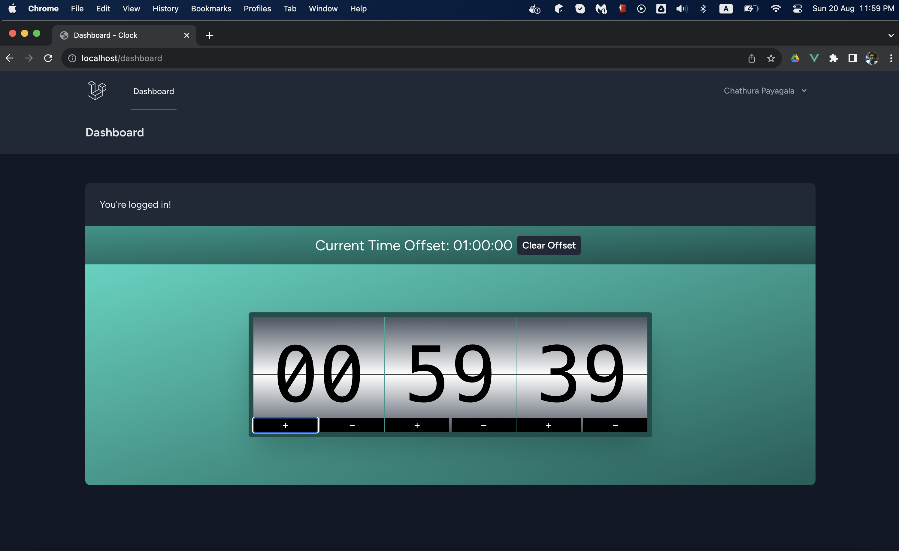
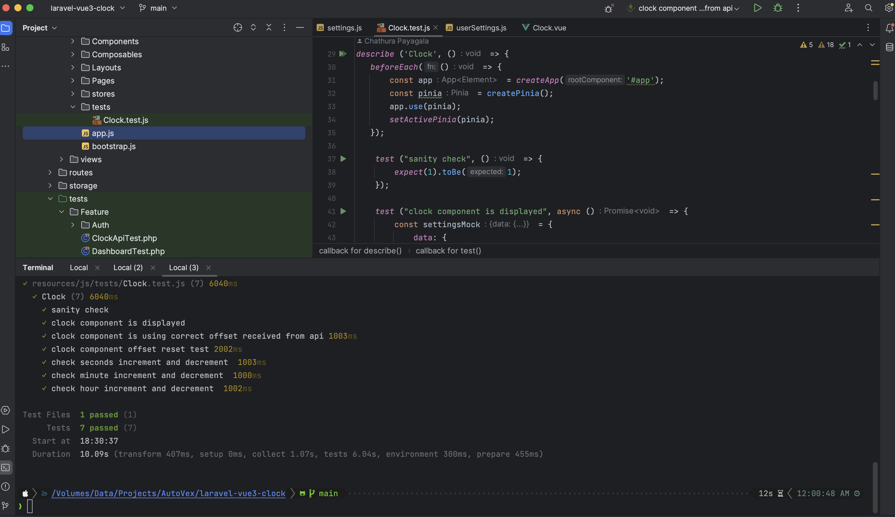
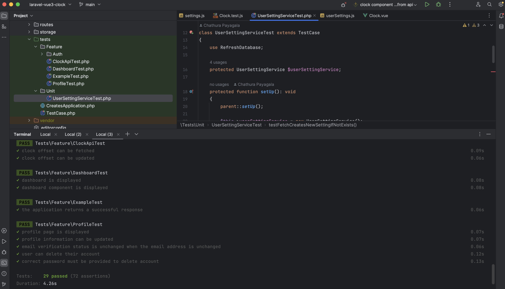

## Demo Project: Clock Dashboard using Laravel 10, Vue.js 3 and Pinia (Vuex alternative)

### Technologies

- Laravel 10
- Vue.js 3
- Inertia.js
- Pinia (Vuex alternative)
- Tailwind CSS
- Laravel Breeze

### Features

- Login
- Logout
- Register
- Forgot Password
- Dashboard
- Clock with customisable time offset (persisted in database)
- PHP Unit Tests
- Vue.js Unit Tests
- Containerised with Docker / Docker Compose

### Installation

1. Clone the repository
2. Install docker and docker-compose
3. Change directory to the project root e.g. `cd laravel-vue3-clock`
4. Copy the `.env.example` file to `.env`. Run `cp app/.env.example app/.env`
4. Run `docker-compose up -d`
5. Navigate to http://localhost in your browser

#### Development

- Run `make npm-dev` to run the vite in watch mode
- See the ***Makefile*** for other useful commands

### Running Tests

- Run `make test-ui` to run the Vue.js tests
- Run `make test` to run the PHP tests

### Screenshots

